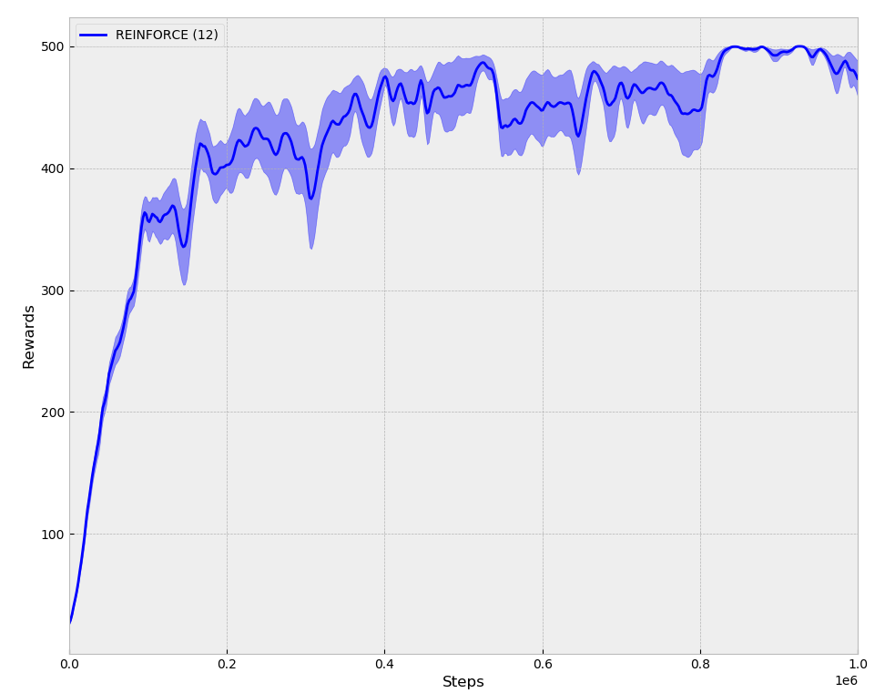

# Policy Gradient Methods for Reinforcement Learning using TF2
1. REINFORCE- http://www-anw.cs.umass.edu/~barto/courses/cs687/williams92simple.pdf 

 Trained on learning rate 0.0001 and discountfactor 0.98
 
 Trained for 12 different seeds and averaged the rewards for the steps with shades as the variances.
